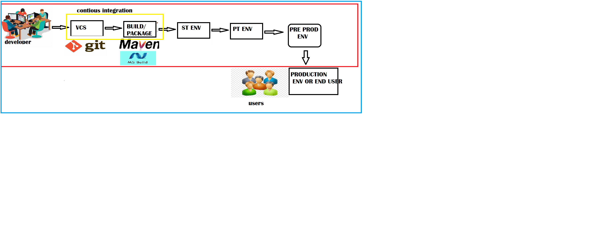

#                               **Azure-DevOps**
### CI/CD Engines

### continous deployment:` Every change of developer will go to production`
### continous delivery: `it will not go to production environnment. it will stay into the local envs and you will  combined the work done 15 day or 30 days and then you will send into production env`
### contnous integration:` Continous integration we don't do any environmental creation. we build the package run very small test to give a feedback to the developer whatever code changes which have done are working or not`
 


#### Azure pipelie is a collection of 
 * Stages: Each stage is collection of `Jobs`
 * Jobs: Each is collection of `Steps`
 * Steps: Steps can be executed by  `tasks or script`
```yaml
pool:
trigger:
stages:
  - stage:
    jobs:
      - job:
        steps:
          - task:
            # or
          - script:  
```
* Here if we have only 1 stage we can directly write from jobs
* If we have only 1 stage and 1 job we can directly write form steps
```
